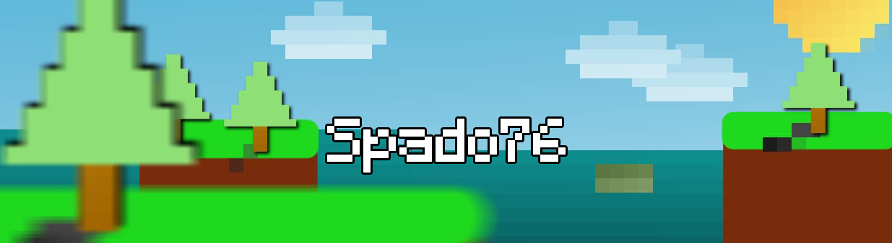

<h1 align="center">Hi 👋, Spado Here</h1>
<h3 align="center">University Student from Indonesia</h3>

  
  
  
  

###

  

###

- 🔭 I’m currently working on **Android App**

- 🌱 I’m currently learning **Artifical Intelligence, Android Development**

- 💻 Mostly code in: **Python**, but I explore other tools too

- 📫 How to reach me: **[Discord](https://discord.gg/T3cB5XC)**

- 🎮 Games I like: Minecraft and Blue Archive

- 🤝 Open to collaboration: Let’s build something awesome

> [!TIP]
> If you dont understand, dont mind to ask.

#

<h3 align="left">Languages and Tools:</h3>

